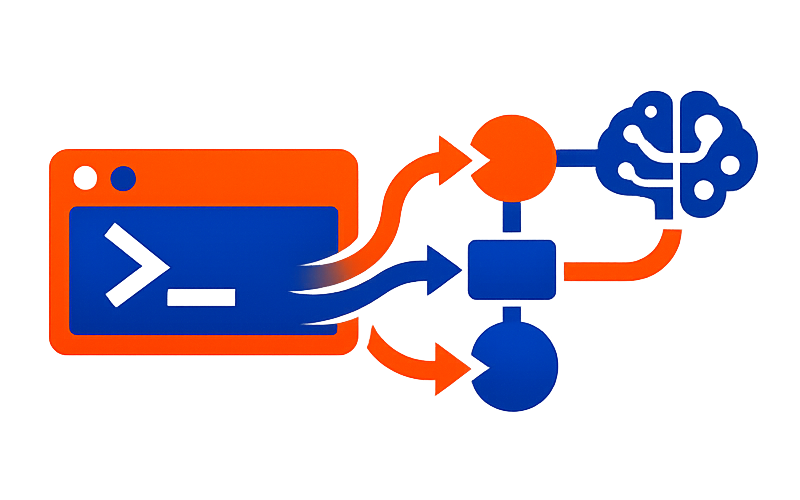

<div align="center" style="text-align: center">


# Prompt Flow

A powerful Laravel-based system for managing programming projects through AI-powered webhook integrations. Receive commands via Telegram, Linear, or Web API, manage projects with AI assistance, and execute tasks using OpenCode or Claude Code CLI.


</div>

---

## Features

### 🤖 AI-Powered Context Analysis
Automatically identifies which project you're referring to by analyzing your message against registered projects. The AI understands project names, descriptions, and paths to determine intent.

### 📱 Multi-Channel Webhooks
Receive requests from multiple sources:
- **Telegram Bot** — Send commands directly to your Telegram bot
- **Web API** — RESTful endpoint for custom integrations
- **Linear** — AI-powered issue processing via webhooks
- **CLI** — Run commands directly from the command line

---

## Installation

### 1. Clone

```bash
git clone https://github.com/b7s/prompt-flow.git && cd prompt-flow
```

### 2. Configure Environment Variables

Add the following variables to your `.env` file and configure the [Telegram Bot](#telegram-bot) (if needed):

```env
APP_EXTERNAL_URL=https://your-external-app-url.com # From ngrok, cloudflare tunnel, vps, etc.

# Default CLI (opencode or claudecode)
DEFAULT_CLI=opencode

# AI Provider (anthropic, openai, ollama, etc.)
AI_FLOW_PROVIDER=anthropic
AI_FLOW_MODEL=claude-sonnet-4-6

# Telegram Bot (optional)
TELEGRAM_BOT_TOKEN=your-telegram-bot-token
TELEGRAM_ENABLED=true

# WhatsApp (optional)
WHATSAPP_API_KEY=your-whatsapp-api-key
WHATSAPP_ENABLED=true

# Linear (optional)
LINEAR_TRIGGER_STATUS=backlog
LINEAR_MOVE_TO_WHEN_FINISH=done
LINEAR_API_KEY=your-linear-api-key
LINEAR_ORGANIZATION_ID=your-organization-id
LINEAR_WEBHOOK_SECRET=your-webhook-secret
LINEAR_TELEGRAM_CHAT_ID=your-telegram-chat-id
LINEAR_ENABLED=true
```
> 1) The external URL is required for communication between Telegram, the API, and Linear.
> 2) Use the `opencode models` command (or `claude models` for Claude Code) to see available models and providers.

### 3. Install

```bash
php artisan install
```

This will:
- ✅ Detect your operating system (Linux, macOS, Windows)
- ✅ Check if Supervisor is installed
- ✅ Create Supervisor configuration automatically
- ✅ Set up the global `pf` CLI command
- ✅ Provide next steps instructions

### 4. Start server:

```bash
php artisan serve
```

---

## Expose your application externally

### If you want to quickly show your application to use on Telegram/API

#### To run Local, you need to run your app:

```bash
php artisan serve
```
Copy the IP address and port and use it in one of the following services above.

### Access out of your local machine:

* [Cloudflare Tunnel](https://developers.cloudflare.com/tunnel/setup/) (better and free)
* [Ngrok](https://ngrok.com/)
* [Tailscale](http://tailscale.com/)

If you want to put it into production, go with:

* [Railway](https://railway.com/) / [Render](https://render.com/) for something simpler. 
* VPS + Nginx + Laravel (DigitalOcean, Hetzner, etc)

---

## Usage

### Interactive CLI Manager

Manage your projects with a beautiful terminal interface:

```bash
php artisan projects
```

Or use the global `pf` command on any folder:

```bash
pf projects
```

> To see all available commands for "pf", use `pf -h`

**Available Operations:**
- 📋 **List Projects** — View all projects in a formatted table
- ➕ **Add Project** — Register a new local project
- ✏️ **Edit Project** — Update project details
- 🗑️ **Remove Project** — Delete a project
- 🔍 **Search Projects** — Find projects by name or path
- 🔑 **Manage API Keys** — Generate and manage Bearer API keys for use in web requests

### Global CLI (pf)

After running `php artisan install`, you can use the `pf` command from any folder. It automatically finds your PromptFlow Laravel app by searching parent directories.

```bash
# Link current folder as a project
pf link

# Unlink current folder from PromptFlow
pf unlink            # Prompts for confirmation
pf unlink --force    # Skips confirmation

# Open interactive manager
pf projects
```

If the global command is not available, create a symlink:

```bash
sudo ln -s /path/to/your-prompt-flow-project/bin/pf /usr/local/bin/pf
```

### Quick Project Linking

Link a project from any folder:

Use the global `pf` command from any directory:

```bash
cd /path/to/my-project
pf link
```

This will:
- Use the current folder as the project path
- Auto-detect project name from folder or `composer.json`/`package.json`
- Auto-detect project type (Laravel, Node, React, Vue, Go, Rust, etc.)
- Auto-detect framework and features
- Auto-detect description from `composer.json`, `package.json` or README
- Set status to Active

**Detected Project Types:**
- Laravel, Symfony, Rails, Django
- Node.js, React, Vue, Next.js, Nuxt, Svelte, Astro
- Bun, Deno
- Go, Rust, Python
- Flutter

**Options:**
```bash
# Custom name
pf link --name="my-project"

# With description
pf link --description="My awesome project"

# With CLI preference
pf link --cli=claudecode

# All options
pf link --name="my-project" --description="..." --cli=claudecode
```

### Run AI-Powered Prompts

Execute AI-powered commands on your projects directly from the CLI:

```bash
# Run a prompt
pf run "list projects"

# Run a prompt on a specific project
pf run "add login functionality to project my-project"

# Run a prompt to analyze code
pf run "understand the authentication flow"
```

The AI will:
1. Analyze your request and identify the target project
2. Execute the appropriate tool (list projects, execute command, etc.)
3. Return plain text results

**Examples:**
```bash
# List all projects
pf run "show me my projects"

# Add a new project
pf run "add new project called my-app at /path/to/my-app"

# Execute a command on a project
pf run "run composer install on project my-project"

# Continue a previous session
pf run "continue from history 1"
```

### Unlink a Project

Unlink (remove) a project from PromptFlow:

```bash
cd /path/to/my-project
pf unlink              # Prompts for confirmation
pf unlink --force      # Skips confirmation
```

### API Endpoints

All endpoints require Bearer token authentication:

| Endpoint | Method | Description |
|----------|--------|-------------|
| `/api/webhook` | POST | Main webhook endpoint |
| `/api/webhook/telegram` | POST | Telegram-specific webhook |
| `/api/webhook/whatsapp` | POST | WhatsApp-specific webhook |
| `/api/webhook/linear` | POST | Linear issue webhook |

**Request Format:**

```json
{
    "message": "Add user registration to the authentication module",
    "channel": "telegram",
    "chat_id": 123456789
}
```

### Example Usage with Telegram

1) Create a bot: https://core.telegram.org/bots/tutorial#obtain-your-bot-token
2) Configure the bot to send messages to your webhook:
    * Add the Token from Telegram `@BotFather` to your `.env` file
    * Register your app webhook url:
        * `php artisan telegram:activate` Direct call
        * `php artisan install` Also activates telegram (won't stop on failure)
3) Send a message to your bot: `Add validation to the login form`

**What happens:**
1. ✅ Respond with "Processing..."
2. 🧠 Analyze which project you're referring to
3. ⚡ Execute the task using the configured CLI
4. 📤 Send the result back to your bot

### Linear Integration

Automate your Linear workflow with AI-powered issue processing:

1. **Create a Linear API key**: Go to Settings > API > Create a personal API key
2. **Get your Organization ID**: Find it in the URL (e.g., `linear.app/team/your-org-id/...`)
3. **Configure your `.env`** with the Linear variables 
4. **Create a webhook**: In Linear Settings > API > Webhooks, add your endpoint:
   - URL: `https://your-app.com/api/webhook/linear`
   - Events: Issues (create, update)
5. **Set up Telegram notifications** (optional): Configure `LINEAR_TELEGRAM_CHAT_ID` to receive notifications

**What happens:**
- When a new issue is created/updated in Linear, the system receives the webhook
- AI analyzes the issue title and description to determine what action to take
- The AI executes the task on the linked project using the configured CLI
- On completion, the system:
  - Updates the issue status to "Done"
  - Adds a comment with the result
  - Adds a ✅ reaction
  - Sends a Telegram notification (if configured)

### Prompt History & Continuation

Every AI prompt execution is automatically recorded, allowing you to review past interactions and continue from where you left off.

**How it works:**
1. When you run a prompt on a project, it's stored with the AI response
2. The CLI session ID is saved so continuations can reuse the same session
3. You can list history for any project or globally
4. Continuing from history passes the full context to continue the conversation

**Commands:**
- **Show history**: "show history", "list history", "what have you done"
- **Continue**: "continue from history [id]", "continue what we were doing"

The system automatically continues in the same CLI session when possible, maintaining conversation context across multiple interactions.

---

## Configuration

### AI Providers

The system supports multiple AI providers through Laravel AI SDK:

**Channel Configuration: `.env`**:

| Provider | Environment Variable | Model |
|----------|---------------------|-------|
| Anthropic | `AI_FLOW_PROVIDER=anthropic` | `claude-sonnet-4-6` |
| OpenAI | `AI_FLOW_PROVIDER=openai` | `gpt-5` |
| Ollama | `AI_FLOW_PROVIDER=ollama` | `llama3` |
| Gemini | `AI_FLOW_PROVIDER=gemini` | `gemini-3` |

---

## Testing

Run the test suite:

```bash
php artisan test --compact
```

---

## Architecture Highlights

### Service-Oriented Design
All business logic is encapsulated in services:
- **ProjectService** — Project CRUD operations
- **ApiKeyService** — API key generation and validation
- **AiContextService** — AI context analysis
- **CliExecutorService** — CLI command execution
- **ResponseService** — Bot response handling

### Queue-Based Processing
Webhook jobs are dispatched to the queue, allowing:
- Instant bot responses
- Background CLI execution
- Retry on failure
- Scalability

---


## System Flow

```
┌───────────────────────────────────────────────────────────────────────────┐
│                                INPUT CHANNELS                             │
├────────────────┬────────────────┬────────────────┬────────────────────────┤
│   Telegram     │    WhatsApp    │    Web API     │         Linear         │
│      Bot       │    Business    │    RESTful     │      Issue Webhook     │
└───────┬────────┴───────┬────────┴───────┬────────┴───────────┬────────────┘
        │                │                │                    │
        └────────────────┴────────────────┴────────────────────┘
                                      │
                                      ▼
                    ┌─────────────────────────────────┐
                    │         Webhook Endpoint        │
                    │          /api/webhook/*         │
                    │       (Bearer Token Auth)       │
                    └─────────────────┬───────────────┘
                                      │
                                      ▼
                    ┌─────────────────────────────────┐
                    │      Queue-Based Processing     │
                    │    (Instant Response + Async)   │
                    └─────────────────┬───────────────┘
                                      │
                                      ▼
                    ┌─────────────────────────────────┐
                    │     AI Context Analysis         │
                    │  • Identifies target project    │
                    │  • Understands user intent      │
                    │  • Analyzes message context     │
                    └─────────────────┬───────────────┘
                                      │
                                      ▼
                    ┌─────────────────────────────────┐
                    │        Project Database         │
                    │   ┌─────────────────────────┐   │
                    │   │ • Name & Path           │   │
                    │   │ • Type (Laravel, etc.)  │   │
                    │   │ • CLI Preference        │   │
                    │   │ • Status                │   │
                    │   └─────────────────────────┘   │
                    └─────────────────┬───────────────┘
                                      │
                                      ▼
              ┌───────────────────────────────────────────────┐
              │            CLI Executor Service               │
              │  Selects: OpenCode ◄──► Claude Code           │
              │  Priority: Project → Default → Context        │
              └───────────────────────┬───────────────────────┘
                                      │
                                      ▼
                    ┌─────────────────────────────────┐
                    │      AI Prompt Execution        │
                    │   • Executes task on project    │
                    │   • Records to history          │
                    │   • Maintains session context   │
                    └─────────────────┬───────────────┘
                                      │
                                      ▼
                    ┌────────────────────────────────────┐
                    │         Response Service           │
                    │   • Formats result                 │
                    │   • Sends to origin channel        │
                    │   • Updates Linear (if applicable) │
                    └────────────────────────────────────┘
                                      │
        ┌─────────────────────────────┼─────────────────────────────┐
        │                             │                             │
        ▼                             ▼                             ▼
┌───────────────┐          ┌───────────────────┐          ┌─────────────────┐
│   Telegram    │          │    WhatsApp       │          │     Linear      │
│   Response    │          │    Response       │          │  • Status: Done │
│               │          │                   │          │  • Comment      │
│               │          │                   │          │  • Reaction ✅  │
└───────────────┘          └───────────────────┘          └─────────────────┘
```

### Flow Summary

1. **Receive** — User sends command via Telegram/WhatsApp/API/Linear
2. **Authenticate** — Validate Bearer token
3. **Queue** — Dispatch a job for async processing (instant confirmation response)
4. **Analyze** — AI identifies the target project and user intent
5. **Select CLI** — Choose OpenCode or Claude Code based on project/config
6. **Execute** — Run an AI-powered task on the project
7. **Record** — Store prompt and response in history
8. **Respond** — Send a result back to the originating channel

---

## Requirements

- PHP 8.4+
- Laravel 13.x
- Laravel AI SDK
- Laravel Prompts
- SQLite (default) or MySQL/PostgreSQL

---

## License

MIT License. See `LICENSE` for details.

---

## Credits

Built with:
- [Laravel](https://laravel.com)
- [Laravel AI SDK](https://github.com/laravel/ai)
- [Laravel Prompts](https://github.com/laravel/prompts)
- [OpenCode](https://opencode.ai)
- [Claude Code](https://docs.anthropic.com/en/docs/claude-code)
